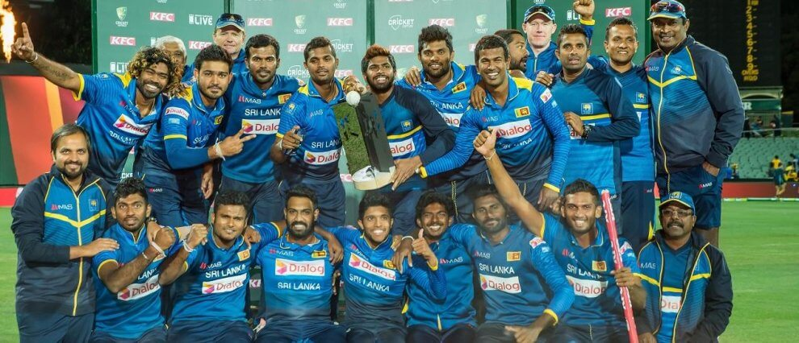
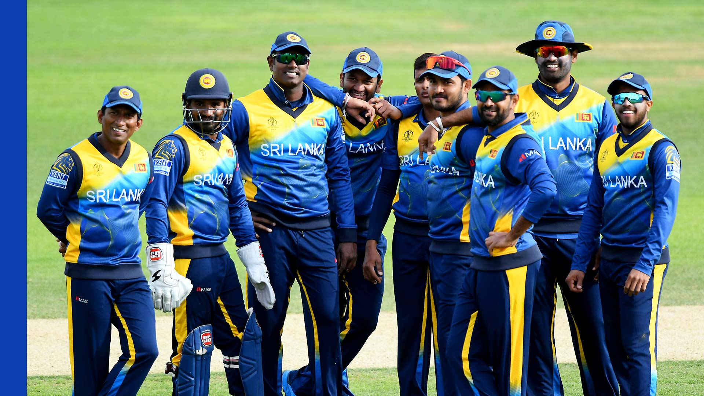
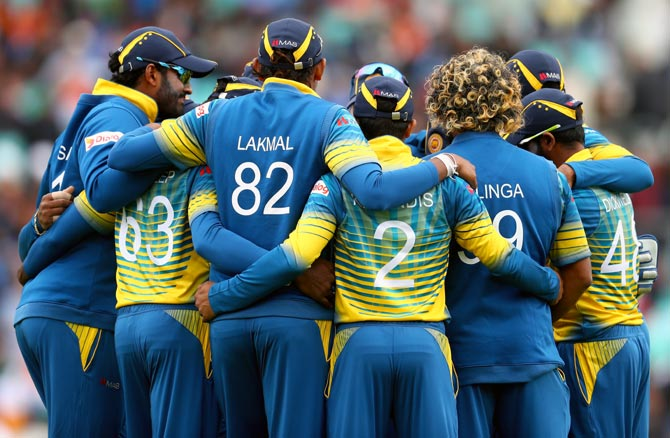

# Srilanka Cricket Fans Club

ONE COUNTRY ONE LOVE.

<section>  </section>

# SRILANKA CRICKET FANS

We love Cricket.

Cricket was introduced to Sri Lanka (then called Ceylon) in the first quarter of the 19th century, following colonisation of the island by the British. The earliest known match was recorded in 1832 and the earliest first-class one in 1926\. The national team has played Test cricket from 1982.

<form onsubmit="greet1(); return false;">

## SignUp

<label for="Name">**Name**</label> <input type="text" placeholder="Enter Email" name="email" required=""> <label for="email">**Email**</label> <input type="text" placeholder="Enter Email" name="email" required=""> <label for="psw">**Password**</label> <input type="password" placeholder="Enter Password" name="psw" required=""> <label for="psw">**Password**</label> <input type="password" placeholder="Repeat Password" name="psw" required=""> <input type="submit" value="Submit">

</form>

<form onsubmit="greet(); return false;">

## Login

<label for="email">**Email**</label> <input type="text" placeholder="Enter Email" name="email" required=""> <label for="psw">**Password**</label> <input type="password" placeholder="Enter Password" name="psw" required=""> <input type="Submit" value="Login">

</form>

## Sri Lankan Cricket Squad.

One Day| T20 | Test
------------ | ------------- | -------------
Dimuth Karunaratne | Lasith Malinga | Dimuth Karunaratne
Lasith Malinga | Avishka Fernando | Lasith Malinga
Kusal Mendis | Kusal Mendis | Kusal Mendis
Kusal Janithe Parera | Kusal Janithe Parera |Kusal Janithe Parera
Angelo Methews | Angelo Methews | Angelo Methews
Dhasun Shanaka | Dhasun Shanaka | Dhasun Shanaka
Dhananjaya de Silva | Dhananjaya de Silva | Dhananjaya de Silva
Thisara Perera | Thisara Perera | Thisara Perera
Wanindu Hasaranga | Wanindu Hasaranga | Wanindu Hasaranga
Lakshan Sandakan | Lakshan Sandakan | Lakshan Sandakan
Isuru Udana | Isuru Udana | Isuru Udana
Nuwan Pradeep | Nuwan Pradeep | Nuwan Pradeep

<form onsubmit="greet2(); return false;">

## CONTACT

Contact us and we'll get back to you within 24 hours.

New York, US

+00 1515151515

myemail@something.com

<input class="form-control" id="name" name="name" placeholder="Name" type="text" required="">

<input class="form-control" id="email" name="email" placeholder="Email" type="email" required="">

<textarea class="form-control" id="comments" name="comments" placeholder="Comment" rows="5"></textarea>  

<input type="submit" value="Submit">

</form>

## Web Page Owner

# Moe Imran

CEO & Founder

SriLankan Cricket Fan Club

<button>Contact</button>

<footer class="container-fluid bg-4 text-center">

@ALL RIGHTS RESERVED.

</footer>

